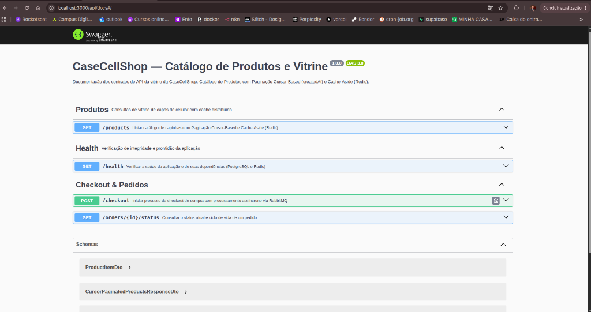
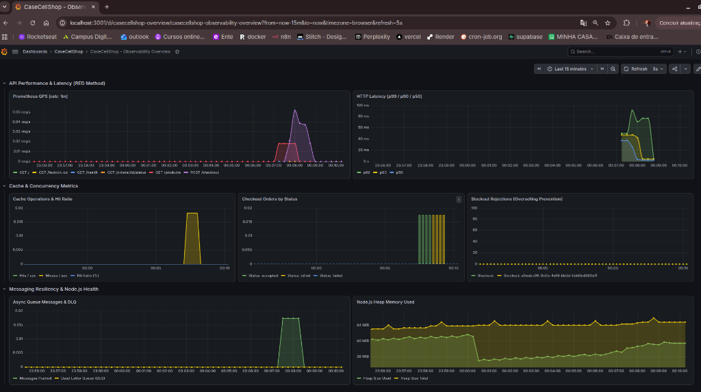
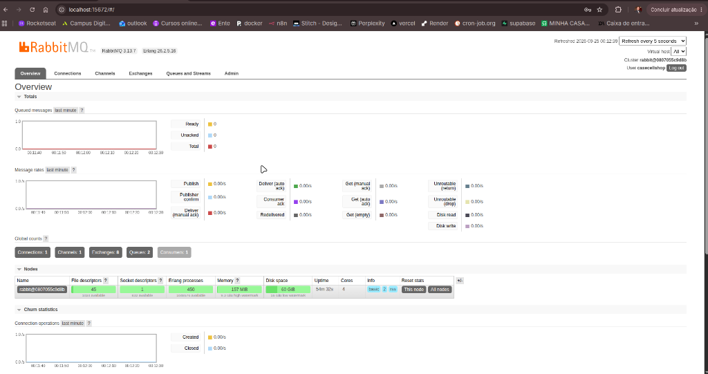

# CaseCellShop — Backend Senior Challenge 🚀

## 📖 Resumo do Projeto
O **CaseCellShop** é um backend resiliente e escalável desenvolvido em **NestJS**, **TypeScript** e **Prisma ORM**, projetado para resolver os três gargalos críticos de um e-commerce sob alto tráfego:
1. **Performance da Vitrine:** Catálogo paginado com **Cache-Aside no Redis**, Fallback Gracioso de 24h e trava distribuída contra **Cache Stampede**.
2. **Consistência de Estoque (Zero Overselling):** Baixa atômica condicional no PostgreSQL com transações ACID e controle rigoroso de **Idempotência no Redis**.
3. **Resiliência no Checkout:** Fluxo assíncrono (**HTTP 202 Accepted**) com mensageria via **RabbitMQ**, Dead Letter Queue (DLQ) e **Padrão SAGA** com transações compensatórias em caso de falha no faturamento.

---

## 🚀 Como Iniciar

### ⚙️ 0. Configurar Variáveis de Ambiente (Pré-requisito Obrigatório)
Antes de iniciar a aplicação (em produção ou desenvolvimento), crie o arquivo `.env` na raiz a partir do modelo:

```bash
# Na raiz do repositório:
cp .env.example .env

# (Ou caso queira apenas renomear):
# mv .env.example .env
```
> **Nota:** É necessário apenas um único arquivo `.env` na raiz do projeto. Tanto o Docker Compose quanto a aplicação local e o Prisma consomem centralizadamente as variáveis a partir dele.

### 🏭 Produção (Docker Compose — 1 Comando)
Para construir as imagens e subir todo o ambiente de produção em segundo plano:
```bash
docker compose up --build -d
```
> O Docker inicializará PostgreSQL, Redis, RabbitMQ, Prometheus, Grafana e a aplicação NestJS com sincronização automática do schema e carga inicial (seed) de **10.000 produtos**.

### 💻 Desenvolvimento Local (Host)
Para rodar a aplicação localmente com hot-reload apontando para os serviços em contêiner:
```bash
# 1. Subir os serviços de infraestrutura
docker compose up -d postgres redis rabbitmq prometheus grafana

# 2. Instalar dependências e preparar o banco
cd app
npm install
npx prisma generate
npx prisma db push
npm run prisma:seed

# 3. Iniciar a API em modo watch
npm run start:dev
```

---

## 🌐 URLs dos Serviços e Como Usar

| Serviço | Ícone | Link de Acesso | Credenciais | Como Usar |
| :--- | :---: | :--- | :--- | :--- |
| **API Backend** | 🌐 | [http://localhost:3000](http://localhost:3000) | N/A | Endpoint base da aplicação para consumo HTTP REST. |
| **Swagger UI** | 📑 | [http://localhost:3000/api/docs](http://localhost:3000/api/docs) | N/A | Interface interativa OpenAPI 3.0 para testar todos os endpoints, parâmetros e schemas. |
| **Grafana** | 📊 | [http://localhost:3001](http://localhost:3001) | `admin` / `admin` | Painéis em tempo real de QPS, latência p99/p90/p50, taxa de acerto do cache e filas. |
| **Prometheus** | 📈 | [http://localhost:9090](http://localhost:9090) | N/A | Consulta de séries temporais e validação de scraping de métricas `/metrics`. |
| **RabbitMQ** | 🐰 | [http://localhost:15672](http://localhost:15672) | `casecellshop` / `casecellshop_pwd` | Gestão visual de filas (`orders.process`, `orders.dlq`) e exchanges AMQP. |
| **Prisma Studio** | 💎 | [http://localhost:5555](http://localhost:5555) | N/A | Interface visual para explorar, filtrar e auditar tabelas do PostgreSQL em tempo real (`cd app && npx prisma studio`). |

---

### 📘 Como Usar a API e Validar o Cache Redis

#### 1. Listagem de Catálogo (Vitrine com Cache Redis)
Execute a chamada no catálogo. A 1ª requisição busca no Postgres e grava no Redis (**MISS**). As chamadas subsequentes respondem diretamente da memória (**HIT** com latência < 5ms):
```bash
# 1ª Chamada (MISS - Popula o Cache)
curl -i http://localhost:3000/products?limit=10

# 2ª Chamada em diante (HIT - Resposta ultra-rápida do Redis)
curl -i http://localhost:3000/products?limit=10
```
*Observe o cabeçalho retornado na resposta:* `x-cache-status: HIT` ou `x-cache-status: MISS`.

#### 2. Checkout Assíncrono com Idempotência
Inicia um pedido de compra retornando `HTTP 202 Accepted`. Chaves repetidas retornam a mesma resposta sem reprocessar:
```bash
curl -X POST http://localhost:3000/checkout \
  -H "Content-Type: application/json" \
  -H "x-idempotency-key: compra-teste-001" \
  -d '{
    "customerId": "c0eebc99-9c0b-4ef8-bb6d-6bb9bd380a33",
    "items": [
      {
        "productId": "a0eebc99-9c0b-4ef8-bb6d-6bb9bd380a11",
        "quantity": 1
      }
    ]
  }'
```

#### 3. Acompanhamento do Pedido
Permite monitorar a evolução do pedido pela esteira assíncrona:
```bash
curl http://localhost:3000/orders/{orderId}/status
```

#### 4. Interface Interativa Swagger UI
Acesse **[http://localhost:3000/api/docs](http://localhost:3000/api/docs)** para testar todos os endpoints interativamente pelo navegador:



---

### 📊 Observabilidade no Grafana

Acesse **`http://localhost:3001`** (login `admin` / senha `admin`). No menu **Dashboards**, entre na pasta **`CaseCellShop`** e abra o dashboard **"CaseCellShop - Observability Overview"** já provisionado de fábrica com:
* **Prometheus QPS [rate-1m]:** Vazão de requisições por segundo por rota.
* **HTTP Latency [p99 / p90 / p50]:** Curva de latência por percentil.
* **Cache Operations & Hit Ratio:** Quantidade de Hits vs Misses do Redis e porcentagem de acerto.
* **Checkout Orders by Status:** Conversão de pedidos (`accepted`, `billed`, `failed`).
* **Stockout Rejections:** Total de compras bloqueadas para evitar overselling.
* **Async Queue & DLQ:** Vazão da fila RabbitMQ e mensagens com falha.
* **Node.js Heap Memory Used:** Diagnóstico de memória do processo Node.js.



---

### 🐰 Gestão de Mensageria no RabbitMQ

Acesse **[http://localhost:15672](http://localhost:15672)** (login `casecellshop` / senha `casecellshop_pwd`):
* Acompanhe as filas ativas **`orders.process`** e a Dead Letter Queue **`orders.dlq`**.
* Verifique o consumidor NestJS conectado com política de controle de fluxo (*Prefetch 10*).



---

### 💎 Explorador Visual do Banco de Dados (Prisma Studio)

Caso queira inspecionar visualmente os dados gravados no PostgreSQL (**10.000 produtos** populados no seed, saldo de estoque em tempo real, pedidos e itens):

```bash
# Na pasta app
cd app
npx prisma studio
# ou com script npm:
npm run prisma:studio
```

* **Link de Acesso:** [http://localhost:5555](http://localhost:5555)
* **Funcionalidades:**
  - Visualização interativa das tabelas `Product`, `Stock`, `Order` e `OrderItem`.
  - Filtros rápidos por ID, preço, quantidade em estoque e status do pedido (`ACCEPTED`, `BILLED`, `FAILED`).
  - Edição e auditoria manual sem necessidade de instalar clientes SQL externos (DBeaver, pgAdmin).

---

## 🛠️ Tecnologias Utilizadas

| Ícone | Tecnologia | Descrição e Finalidade no Projeto |
| :---: | :--- | :--- |
|  | **NestJS 10** | Framework Node.js corporativo estruturado com injeção de dependências e modularidade. |
|  | **TypeScript 5** | Tipagem estática rigorosa para garantir consistência de domínio e contratos de API. |
|  | **Prisma ORM 7** | Camada de acesso a dados tipada com Driver Adapter nativo PostgreSQL e migrations declarativas. |
|  | **PostgreSQL 16** | Banco relacional com integridade ACID, baixa atômica de estoque e constraints `CHECK (qty >= 0)`. |
|  | **Redis 7** | Cache em memória de baixa latência, locks distribuídos anti-stampede e controle de idempotência. |
|  | **RabbitMQ 3** | Message Broker com Direct Exchange durável, Prefetch QoS e Dead Letter Queue (DLQ). |
|  | **Prometheus** | Servidor TSDB de coleta de métricas (OpenMetrics) em intervalos de 5 segundos via `/metrics`. |
|  | **Grafana 11** | Painéis visuais analíticos pré-provisionados como código para auditoria de SLOs e saúde do sistema. |
|  | **Docker & Compose** | Empacotamento em contêineres multi-stage leves e orquestração unificada de toda a stack. |
|  | **Jest** | Suíte de testes automatizados unitários, de integração e de concorrência com estresse de 100 threads. |

---

## 📚 Documentação Técnica Aprofundada

A documentação detalhada foi separada em capítulos modulares e aprofundados na pasta [`docs/`](docs/):

* 01. 📖 [**Central de Documentação & Guia Rápido**](docs/01.README.md): Índice mestre, portas ativas e prévias visuais.
* 02. 🏛️ [**Arquitetura & Princípios SOLID**](docs/02.ARCHITECTURE.md): Clean Architecture, Monólito Modular, DIP com Tokens e divisão estrita de responsabilidades.
* 03. 🧠 [**Padrões & Decisões Técnicas**](docs/03.PATTERNS_AND_DECISIONS.md): Padrão SAGA com Compensação, Idempotência no Redis, Paginação por Cursor Base64 $O(1)$, Baixa Atômica e Delay de 30s no Consumer.
* 04. 📊 [**Diagramas do Sistema (Mermaid)**](docs/04.SYSTEM_DIAGRAMS.md): Topologia de microsserviços, diagramas de sequência da Vitrine com Cache-Aside e do Checkout Assíncrono com Máquina de Estados.
* 05. 🗄️ [**Modelagem de Dados & ERD**](docs/05.DATABASE_DIAGRAMS.md): Diagrama Entidade-Relacionamento (ERD), dicionário de dados, constraints `CHECK (qty >= 0)` e índices B-tree.
* 06. ⚡ [**Infraestrutura de Cache (Redis)**](docs/06.INFRASTRUCTURE_AND_CACHE.md): Cache-Aside com TTL (30s), Fallback Gracioso de 24h, Mutex Anti-Stampede e configurações do `redis.conf`.
* 07. 📈 [**Observabilidade & Telemetria**](docs/07.OBSERVABILITY.md): Métricas Prometheus, Dashboards Grafana pré-provisionados, Logs Estruturados com Pino, Tracing com Correlation ID, SLIs, SLOs e Runbooks.
* 08. 🐰 [**Mensageria & Resiliência (RabbitMQ)**](docs/08.MESSAGING_AND_RESILIENCE.md): Direct Exchange, Prefetch QoS, Dead Letter Queue (`orders.dlq`) e simulação de falhas do ERP.
* 09. 📑 [**Especificação da API REST (OpenAPI)**](docs/09.API_DOCUMENTATION.md): Endpoints Swagger, payloads de requisição/resposta, cabeçalhos de idempotência e catálogo de erros mapeados.
* 10. 🧪 [**Testes Automatizados & Concorrência**](docs/10.TESTS_AND_BENCHMARKS.md): Estresse com 100 requisições simultâneas para 10 itens com Zero Overselling, testes de idempotência e cobertura Jest.
* 11. 📝 [**Respostas Conceituais (Parte 1.A)**](docs/11.RESPOSTAS_CONCEITUAIS.md): Diagnóstico aprofundado dos 3 problemas, análise de causa raiz, trade-offs, visão 30-90 dias, estratégias de cache, observabilidade e resiliência.

👉 **[Acessar Central de Documentação Técnica (docs/01.README.md)](docs/01.README.md)**

---

## 🧪 Testes Automatizados

O projeto inclui suíte completa de testes automatizados com Jest:

```bash
# Executar todos os testes
cd app
npm test
```

### Prova de Fogo contra Overselling (`test/concurrency.spec.ts`)
- **Estoque inicial:** 10 unidades.
- **Disparo simultâneo:** 100 requisições concorrentes disparadas no mesmo milissegundo.
- **Resultado:** Exatamente 10 pedidos aprovados (`HTTP 202`), exatamente 90 pedidos rejeitados com conflito (`HTTP 409`) e saldo final rigorosamente **0**. Zero overselling.