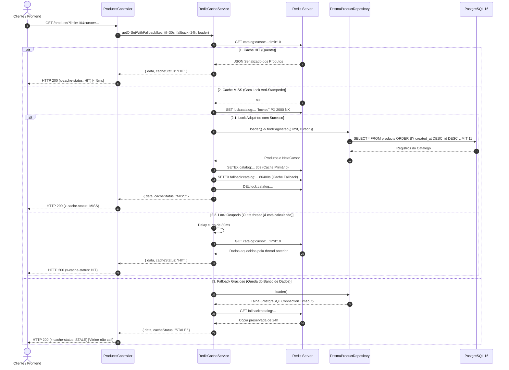
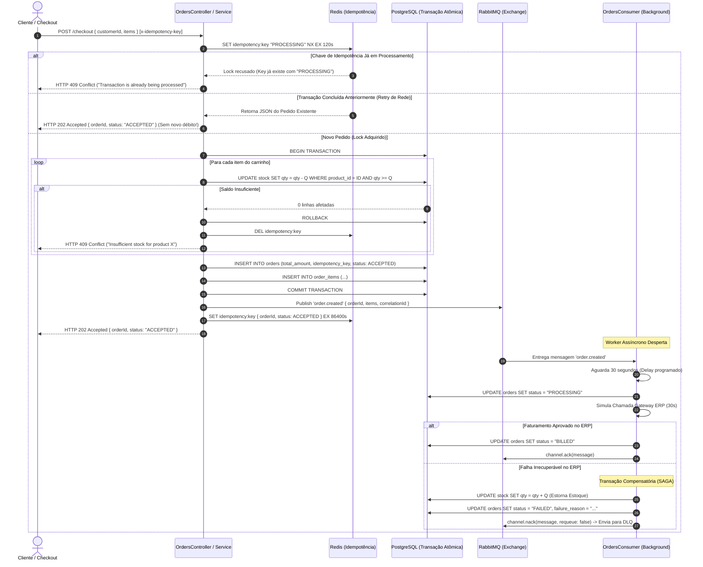
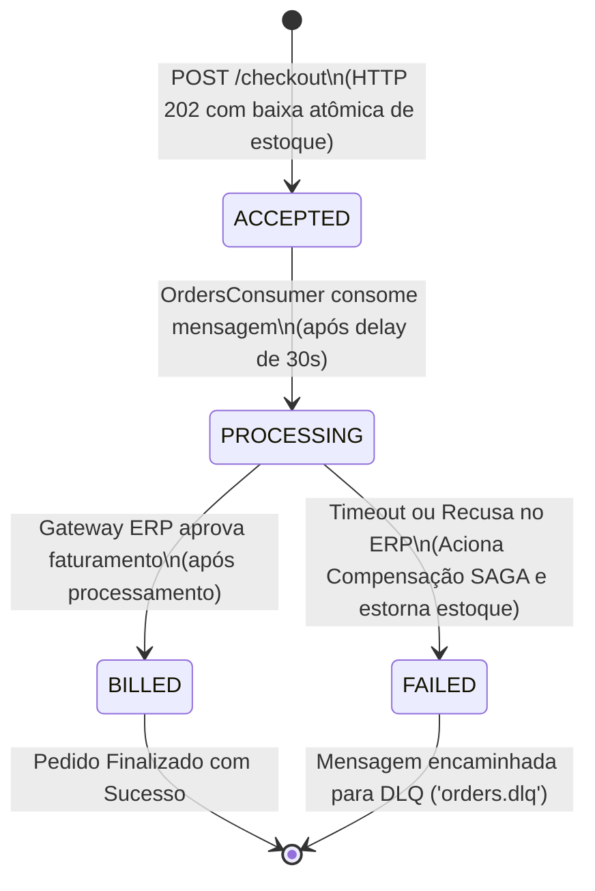

# 📊 Diagramas do Sistema — Fluxos e Interações

Este documento contém os diagramas visuais e conceituais do **CaseCellShop**, modelados em sintaxe nativa **Mermaid** para documentação contínua como código.

---

## 1. Visão Geral da Topologia de Serviços

```mermaid
flowchart TD
    subgraph Clients[" Clientes & Consumidores "]
        UserBrowser["Navegador Web / Mobile"]
        SwaggerClient["Swagger UI / Postman"]
    end

    subgraph IngressLayer[" Camada de Ingress & Transporte "]
        App["Backend NestJS (API & Worker)\n:3000"]
    end

    subgraph DataStorage[" Persistência & Cache "]
        Postgres[("PostgreSQL 16\n:5432\n(products, stock, orders)")]
        Redis[("Redis 7 Cache\n:6379\n(Catalog Cache, Locks, Idempotency)")]
    end

    subgraph MessagingLayer[" Mensageria Assíncrona "]
        Rabbit["RabbitMQ 3 Management\n:5672 / :15672\n(orders.exchange, orders.process, orders.dlq)")]
    end

    subgraph ObservabilityLayer[" Telemetria & Monitoramento "]
        Prometheus["Prometheus TSDB\n:9090\n(Scrape a cada 5s)"]
        Grafana["Grafana Dashboards\n:3001\n(Dashboards Provisionados)"]
    end

    UserBrowser -->|HTTP GET /products| App
    UserBrowser -->|HTTP POST /checkout| App
    SwaggerClient -->|HTTP /api/docs| App

    App -->|Cache-Aside / Locks| Redis
    App -->|Baixa Atômica / Pedidos| Postgres
    App -->|Publicação de Eventos AMQP| Rabbit
    Rabbit -->|Consumo em Background| App

    Prometheus -->|Scrape /metrics| App
    Grafana -->|PromQL Queries| Prometheus
```

---

## 2. Diagrama de Sequência: Vitrine de Produtos com Cache-Aside



---

## 3. Diagrama de Sequência: Checkout Assíncrono com Idempotência e SAGA



---

## 4. Diagrama de Transição de Estados do Pedido (State Machine)


