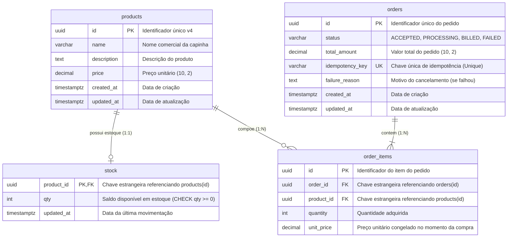

# 🗄️ Modelagem de Dados e Diagrama ERD

Este documento apresenta a modelagem relacional do banco de dados **PostgreSQL 16** via **Prisma ORM 7**, detalhando entidades, tipos primitivos, chaves estrangeiras, índices e regras de integridade física.

---

## 1. Diagrama Entidade-Relacionamento (ERD)



---

## 2. Dicionário de Dados e Estrutura das Tabelas

### 2.1. Tabela `products`
Armazena o catálogo de capinhas e acessórios da loja.

| Coluna | Tipo | Nulo | Default | Descrição / Regra |
| :--- | :--- | :---: | :--- | :--- |
| `id` | `UUID` | Não | `gen_random_uuid()` | Chave Primária única v4. |
| `name` | `VARCHAR(255)` | Não | — | Nome comercial do produto. |
| `description`| `TEXT` | Sim | `NULL` | Descrição detalhada e atributos. |
| `price` | `DECIMAL(10,2)`| Não | — | Preço de venda com precisão monetária. |
| `created_at` | `TIMESTAMPTZ(6)`| Não | `now()` | Timestamp com timezone para ordenação de cursor. |
| `updated_at` | `TIMESTAMPTZ(6)`| Não | `now()` | Timestamp da última modificação. |

### 2.2. Tabela `stock`
Tabela segregada para isolamento de locks e garantia de alta concorrência na baixa de estoque.

| Coluna | Tipo | Nulo | Default | Descrição / Regra |
| :--- | :--- | :---: | :--- | :--- |
| `product_id` | `UUID` | Não | — | Chave Primária e Estrangeira para `products.id` (`ON DELETE CASCADE`). |
| `qty` | `INT` | Não | `0` | Quantidade física disponível. Possui constraint `CHECK (qty >= 0)`. |
| `updated_at` | `TIMESTAMPTZ(6)`| Não | `now()` | Timestamp da última baixa ou estorno. |

### 2.3. Tabela `orders`
Registra os pedidos gerados no checkout e o acompanhamento da esteira assíncrona.

| Coluna | Tipo | Nulo | Default | Descrição / Regra |
| :--- | :--- | :---: | :--- | :--- |
| `id` | `UUID` | Não | `gen_random_uuid()` | Chave Primária do pedido. |
| `status` | `VARCHAR(30)` | Não | `'ACCEPTED'` | Status do pedido (`ACCEPTED`, `PROCESSING`, `BILLED`, `FAILED`). |
| `total_amount`| `DECIMAL(10,2)`| Não | — | Somatório dos itens no momento do checkout. |
| `idempotency_key`| `VARCHAR(255)`| Sim | `NULL` | Chave única (`UNIQUE`) para prevenção de duplicidade. |
| `failure_reason`| `TEXT` | Sim | `NULL` | Mensagem de erro em caso de estorno ou recusa do ERP. |
| `created_at` | `TIMESTAMPTZ(6)`| Não | `now()` | Data de criação do pedido. |
| `updated_at` | `TIMESTAMPTZ(6)`| Não | `now()` | Data da última alteração de status. |

### 2.4. Tabela `order_items`
Contém os itens individuais de cada pedido, preservando o histórico de preços.

| Coluna | Tipo | Nulo | Default | Descrição / Regra |
| :--- | :--- | :---: | :--- | :--- |
| `id` | `UUID` | Não | `gen_random_uuid()` | Chave Primária do item. |
| `order_id` | `UUID` | Não | — | FK para `orders.id` (`ON DELETE CASCADE`). |
| `product_id` | `UUID` | Não | — | FK para `products.id` (`ON DELETE RESTRICT`). |
| `quantity` | `INT` | Não | — | Quantidade comprada (mínimo 1). |
| `unit_price` | `DECIMAL(10,2)`| Não | — | Preço unitário no momento da compra (snapshot). |

---

## 3. Índices Estratégicos e Otimização de Consultas

### 3.1. Índice Composto de Paginação por Cursor
```sql
CREATE INDEX idx_products_created_at_id ON products (created_at DESC, id DESC);
```
* **Finalidade:** Viabiliza a paginação por cursor em tempo constante $O(1)$.
* **Por que é essencial?** Ao executar `WHERE created_at < cursor.createdAt OR (created_at = cursor.createdAt AND id < cursor.id) ORDER BY created_at DESC, id DESC LIMIT 1000`, o PostgreSQL utiliza um **Index Scan** puro, sem necessidade de ordenar tabelas em disco (evita operações caras de `Sort` e `Temporary Files`).

### 3.2. Índice de Consulta de Pedidos
```sql
CREATE INDEX idx_orders_status ON orders (status);
```
* **Finalidade:** Permite relatórios e consultas rápidas sobre pedidos pendentes de faturamento (`PROCESSING`) ou falhados (`FAILED`) sem full-table scan.
* **Índice Único de Idempotência:** A constraint `UNIQUE (idempotency_key)` atua como segunda camada de defesa no nível do banco, impedindo inserções duplicadas mesmo se duas instâncias do backend executassem em microssegundos coincidentes.

---

## 4. Visualização e Auditoria Interativa com Prisma Studio

Para visualizar, filtrar e auditar diretamente todas as tabelas do PostgreSQL (`products`, `stock`, `orders`, `order_items`) em uma interface web visual:

```bash
# Na pasta da aplicação
cd app
npx prisma studio
# ou:
npm run prisma:studio
```

* **URL de Acesso:** [http://localhost:5555](http://localhost:5555)
* **Vantagens Práticas:**
  1. **Navegação pelos 10.000 Produtos:** Verificação imediata dos itens inseridos pelo seed sem precisar de scripts SQL manuais.
  2. **Auditoria de Estoque em Tempo Real:** Acompanhamento do decremento de `stock.quantity` durante testes de concorrência ou checkout.
  3. **Rastreamento de Pedidos e Itens:** Inspeção direta do campo `status` (`ACCEPTED`, `BILLED`, `FAILED`) e do histórico de preços gravado em `order_items`.
  4. **Zero Dependência:** Não requer instalação de clientes pesados como DBeaver ou pgAdmin.
