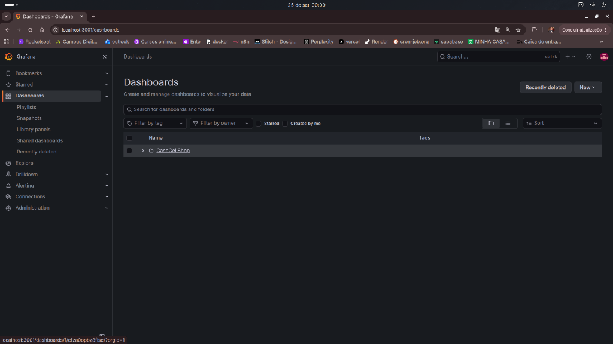
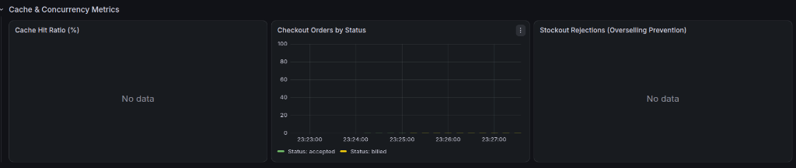

# 📊 Observabilidade — Prometheus, Grafana e Logs Estruturados

Este documento descreve a infraestrutura de telemetria e observabilidade implementada no **CaseCellShop**, cobrindo o modelo de métricas **Prometheus**, dashboards **Grafana**, logs estruturados com **Pino** e rastreabilidade distribuída via **Correlation ID**.

---

## 1. Visão Geral: O que foi usado, Para que e Por que

| Tecnologia | O que foi usado? | Para que foi usado? | Por que foi usado? |
| :--- | :--- | :--- | :--- |
| **Prometheus** | Servidor Prometheus v2.x (TSDB) com scrape automático a cada 5s e biblioteca `prom-client` no NestJS. | Coleta contínua de métricas HTTP, taxas de cache, contadores de checkout, filas AMQP e consumo de memória. | Padrão da indústria CNCF para métricas baseadas no modelo pull (OpenMetrics), com linguagem PromQL poderosa para agregação. |
| **Grafana** | Grafana 11 com provisionamento declarativo como código (`infra/grafana/provisioning/`). | Exibição visual unificada de gráficos de QPS, latência p99/p90/p50, hit ratio do Redis e monitoramento de falhas. | Visibilidade instantânea para o time de engenharia e liderança técnica, sem necessidade de configuração manual. |
| **Pino Logger** | Structured Logger com serialização JSON em stdout e injeção assíncrona de contexto. | Registro de eventos operacionais e erros com severidade diferenciada (`warn` para 4xx, `error` com stack para 5xx). | Baixo overhead de CPU (< 5% vs Winston), compatível com agregadores modernos (Datadog, Loki, Elasticsearch). |

---

## 2. Métricas Instrumentadas na Aplicação

A aplicação expõe o endpoint padrão **`GET /metrics`** compatível com OpenMetrics / Prometheus:

### 2.1. Métricas da Camada HTTP (Metodologia RED)
* **Histograma de Latência:** `http_request_duration_seconds{route, method, status_code}`
  - Mede a duração de cada requisição em segundos através de alta precisão com `process.hrtime()`.
  - Buckets: `[0.005, 0.01, 0.025, 0.05, 0.1, 0.25, 0.5, 1, 2.5, 5]`.
  - Permite calcular percentis reais p50, p90 e p99.
* **Throughput (QPS):** `rate(http_request_duration_seconds_count[1m])`.

### 2.2. Métricas de Cache (Redis)
* **Contador de Requisições:** `cache_requests_total{status="hit|miss"}`
  - `status="hit"`: Requisições atendidas diretamente pela memória do Redis em < 5ms.
  - `status="miss"`: Requisições que exigiram consulta ao PostgreSQL.
  - **Fórmula de Hit Ratio:**
    $$\text{Hit Ratio (\%)} = \left(\frac{\text{rate(cache\_requests\_total}\{status="hit"\}[5m])}{\text{rate(cache\_requests\_total}[5m])}\right) \times 100$$

### 2.3. Métricas de Negócio e Concorrência
* **Funil de Pedidos:** `checkout_orders_total{status="accepted|billed|failed"}`
  - `accepted`: Compras aceitas e enfileiradas (`HTTP 202`).
  - `billed`: Pedidos faturados com sucesso no ERP após a esteira assíncrona.
  - `failed`: Pedidos rejeitados por recusa bancária ou falha irreversível do ERP.
* **Bloqueio de Overselling:** `checkout_stockout_rejected_total{product_id}`
  - Incrementado sempre que uma tentativa de compra é barrada por estoque esgotado (`HTTP 409 Conflict`).

### 2.4. Métricas de Mensageria e Fila
* **Mensagens Publicadas:** `queue_messages_pushed_total`
* **Mensagens na Dead Letter Queue:** `queue_messages_dlq_total`
* **Mensagens em Espera:** `queue_messages_waiting` (Gauge).

---

## 3. Dashboard Provisionado no Grafana (`CaseCellShop - Observability Overview`)

Ao iniciar os contêineres, o Grafana provisiona automaticamente o dashboard na porta **`http://localhost:3001`**:

### 3.1. Como Acessar o Dashboard Passo a Passo
1. Abra no navegador: [http://localhost:3001](http://localhost:3001)
2. Efetue o login com as credenciais padrão:
   - **Usuário:** `admin`
   - **Senha:** `admin`
3. No menu lateral esquerdo, clique em **Dashboards**.
4. Você verá a pasta provisionada automaticamente **`CaseCellShop`**:



5. Clique em **`CaseCellShop - Observability Overview`** para visualizar todas as métricas em tempo real:

### 3.2. Dashboard Principal em Execução (QPS, Latência, Cache, DLQ e Memória)


### 3.3. Painéis de Cache e Concorrência



### 3.4. Descrição dos Painéis
1. **Prometheus QPS [rate-1m]:** Área empilhada com vazão de requisições por segundo agrupadas por rota e método HTTP.
2. **HTTP Latency [p99 / p90 / p50]:** Linhas temporais com os percentis de tempo de resposta da API (medidos com precisão de nanosegundos).
3. **Cache Operations & Hit Ratio:** Taxa de Hits/segundo, Misses/segundo e porcentagem de eficiência do Redis com fallback seguro para 0% em ociosidade.
4. **Checkout Orders by Status:** Gráfico de barras indicando a conversão de pedidos por estado da esteira (`accepted`, `billed`, `failed`).
5. **Stockout Rejections (Overselling Prevention):** Contador em tempo real das compras barradas para proteger o estoque físico.
6. **Async Queue Messages & DLQ:** Comparativo entre fluxo normal e mensagens com desvio para a Dead Letter Queue.
7. **Node.js Heap Memory Used:** Diagnóstico de consumo de memória do runtime V8.

---

## 4. Scraping e Validação em Tempo Real

Abaixo os dados reais de telemetria coletados diretamente dos serviços em execução:

### 4.1. Status dos Alvos no Prometheus (`http://localhost:9090/api/v1/targets`)
```json
[
  {
    "job": "casecellshop-backend",
    "health": "up",
    "scrapeUrl": "http://app:3000/metrics",
    "lastScrapeDuration": 0.004
  },
  {
    "job": "prometheus",
    "health": "up",
    "scrapeUrl": "http://localhost:9090/metrics"
  }
]
```

### 4.2. Amostra Real de Métricas Coletadas (`/metrics`)
```prometheus
# HELP cache_requests_total Total de requisições enviadas ao cache Redis
# TYPE cache_requests_total counter
cache_requests_total{status="hit"} 2
cache_requests_total{status="miss"} 1

# HELP checkout_orders_total Total de pedidos processados no checkout por status
# TYPE checkout_orders_total counter
checkout_orders_total{status="accepted"} 1
checkout_orders_total{status="billed"} 1
checkout_orders_total{status="failed"} 0

# HELP http_request_duration_seconds Duração das requisições HTTP em segundos
# TYPE http_request_duration_seconds histogram
http_request_duration_seconds_bucket{le="0.05",route="/checkout",method="POST",status_code="202"} 0
http_request_duration_seconds_bucket{le="0.25",route="/checkout",method="POST",status_code="202"} 1
http_request_duration_seconds_sum{route="/checkout",method="POST",status_code="202"} 0.101041635
http_request_duration_seconds_count{route="/checkout",method="POST",status_code="202"} 1
```

---

## 5. Logs Estruturados e Rastreabilidade Distribuída

### 5.1. Formato Padrão do Log (JSON)
Todos os logs são emitidos em formato JSON estrito para ingestão em tempo real:
```json
{
  "level": "warn",
  "time": "2026-09-24T23:25:00.123Z",
  "correlation_id": "c0eebc99-9c0b-4ef8-bb6d-6bb9bd380a33",
  "statusCode": 409,
  "path": "/checkout",
  "method": "POST",
  "msg": "[HTTP 409] Falha na requisição POST /checkout: Insufficient stock for product \"a0eebc99-9c0b-4ef8-bb6d-6bb9bd380a11\". Transaction cancelled."
}
```

### 5.2. Rastreabilidade com `AsyncLocalStorage`
* O [`CorrelationIdMiddleware`](file:///home/gabriel/Documentos/CaseCellShop/app/src/infra/observability/correlation-id.middleware.ts) captura o cabeçalho HTTP `x-correlation-id` ou gera um novo UUID v4.
* Esse identificador é injetado no `AsyncLocalStorage` do Node.js, ficando acessível de forma transparente para services, repositórios, workers e logs sem necessidade de repassar parâmetros manualmente em cada função.
* Ao publicar eventos no RabbitMQ, o `correlationId` é anexado no envelope da mensagem, permitindo que o `OrdersConsumer` vincule os logs de faturamento ao request HTTP original do cliente.

---

## 6. SLIs, SLOs e Runbooks Operacionais

### 5.1. Objetivos de Nível de Serviço (SLO)
| Serviço | Indicador (SLI) | Meta (SLO) | Janela |
| :--- | :--- | :---: | :---: |
| **Vitrine (GET /products)** | Latência p95 < 20ms | 99.5% | 30 dias |
| **Disponibilidade da Vitrine** | Status HTTP < 500 | 99.9% | 30 dias |
| **Cache Hit Ratio** | Hits / (Hits + Misses) | > 85.0% | 7 dias |
| **Checkout Assíncrono** | Latência p99 < 150ms | 99.0% | 30 dias |
| **Integridade de Estoque** | Taxa de Overselling | **0.0%** (Rigoroso) | Contínuo |

### 5.2. Runbook: Alerta de Mensagens na DLQ (`queue_messages_dlq_total > 0`)
1. **Identificação:** O alerta de severidade P1 dispara quando mensagens se acumulam na fila `orders.dlq`.
2. **Triagem:** Acessar o RabbitMQ Management (`http://localhost:15672`), navegar até a fila `orders.dlq` e inspecionar os headers da mensagem.
3. **Localização do Contexto:** Copiar o `correlationId` da mensagem e filtrar no Grafana/Loki para visualizar o stack trace do erro.
4. **Resolução:**
   - Se for falha transitória do ERP (ex: instabilidade de rede ou timeout de API): reprocessar as mensagens da DLQ de volta para a fila `orders.process` via funcionalidade Shovel do RabbitMQ.
   - Se for recusa permanente de pagamento: validar se o estoque foi estornado corretamente pelo worker (`incrementStockAtomic`) e notificar o cliente via e-mail/notificação.
