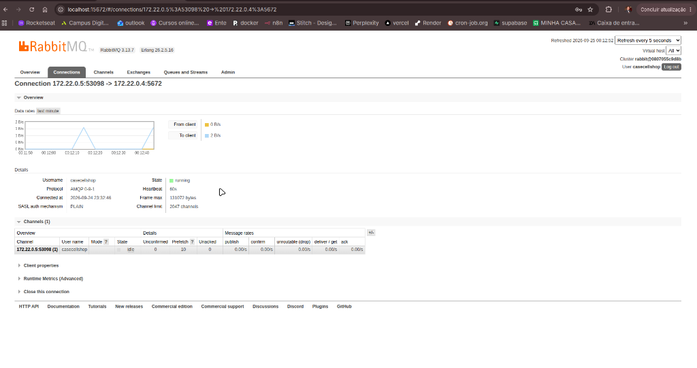

# 🐰 Mensageria e Resiliência Assíncrona com RabbitMQ

Este documento detalha a arquitetura de mensageria assíncrona baseada em **RabbitMQ 3**, cobrindo topologia AMQP, Dead Letter Queues (DLQ), garantias de entrega e padrões de resiliência.

---

## 1. Visão Geral: O que foi usado, Para que e Por que

| Aspecto | Especificação |
| :--- | :--- |
| **O que foi usado?** | **RabbitMQ 3 com plugin de Management**, cliente oficial **`amqplib`** integrado nativamente ao NestJS via [`RabbitMQService`](file:///home/gabriel/Documentos/CaseCellShop/app/src/infra/messaging/rabbitmq.service.ts). |
| **Para que foi usado?** | 1. Desacoplamento temporal entre o checkout e o faturamento do ERP.<br>2. Bufferização de picos de tráfego (Flash Sales).<br>3. Roteamento seguro de mensagens com falha para Dead Letter Queue (DLQ). |
| **Por que foi usado?** | Protocolo AMQP 0-9-1 maduro, suporte nativo a Dead Letter Exchanges declarativas, controle de vazão por consumidor (*Prefetch QoS*) e alta confiabilidade de entrega sem perda de mensagens. |

---

## 2. Topologia AMQP Declarativa

A topologia é estabelecida de forma idempotente e automática no boot da aplicação:

```text
               ┌──────────────────────────────┐
               │        orders.exchange       │
               │       (Direct Exchange)      │
               └──────────────┬───────────────┘
                              │
               Routing Key: 'order.created'
                              │
                              ▼
               ┌──────────────────────────────┐
               │        orders.process        │
               │   (Fila Principal Durável)   │
               │   x-dead-letter-exchange:    │
               │       'orders.exchange'      │
               │   x-dead-letter-routing-key: │
               │         'orders.dlq'         │
               └──────────────┬───────────────┘
                              │ (Falha irrecuperável / nack)
                              ▼
               ┌──────────────────────────────┐
               │          orders.dlq          │
               │   (Dead Letter Queue Segura) │
               └──────────────────────────────┘
```

### Componentes Declarados:
1. **Direct Exchange (`orders.exchange`):** Roteia mensagens diretamente para filas com base em routing keys exatas (`durable: true`).
2. **Fila Principal (`orders.process`):**
   - Recebe pedidos recém-criados vinculados à routing key `order.created`.
   - Configurada com argumentos de Dead Lettering:
     - `deadLetterExchange: 'orders.exchange'`
     - `deadLetterRoutingKey: 'orders.dlq'`
3. **Dead Letter Queue (`orders.dlq`):**
   - Retém mensagens que falharam definitivamente após esgotamento de retentativas ou erros irrecuperáveis do ERP.

### 2.1. Painel de Filas em Execução no RabbitMQ Management

Abaixo o painel do RabbitMQ Management exibindo as duas filas provisionadas, estados de prontidão e consumo:


---

## 3. Garantias de Entrega e Confiabilidade

### 3.1. Publicação Segura e Persistência
No método `publish` do [`RabbitMQService`](file:///home/gabriel/Documentos/CaseCellShop/app/src/infra/messaging/rabbitmq.service.ts):
```typescript
channel.publish(this.EXCHANGE_NAME, routingKey, payload, {
  persistent: true,             // Mensagem gravada em disco pelo RabbitMQ
  contentType: 'application/json',
  timestamp: Date.now(),
});
```
* Assegura que, mesmo se o nó do RabbitMQ for reiniciado, nenhuma mensagem enfileirada seja perdida.

### 3.2. Controle de Fluxo (*Prefetch QoS*)
* O consumidor aplica `channel.prefetch(10)`.
* Isso impede que um worker seja sobrecarregado com milhares de mensagens simultâneas. O RabbitMQ envia no máximo **10 mensagens** não confirmadas por vez para o processo, garantindo estabilidade de memória e CPU:



### 3.3. Confirmações Explícitas (*Ack / Nack*)
No [`OrdersConsumer`](file:///home/gabriel/Documentos/CaseCellShop/app/src/infra/messaging/orders.consumer.ts):
* **Sucesso:** Se o faturamento for concluído com êxito, a aplicação emite `channel.ack(msg)`, removendo a mensagem da fila.
* **Falha:** Em caso de erro irrecuperável, a aplicação executa a **transação compensatória SAGA (estorno de estoque)** e emite `channel.nack(msg, false, false)`.
* Como `requeue = false`, o RabbitMQ despacha automaticamente a mensagem com erro para a `orders.dlq`.

---

## 4. Simulação de Falhas do ERP para Teste de Resiliência

Para permitir validação prática sem dependência de um ERP real externo:
* Qualquer pedido com ID contendo a substring **`fail-erp`** (ou produtos forçados para simular erro) aciona propositalmente uma falha irrecuperável de gateway no worker:
  ```typescript
  if (orderId.includes('fail-erp')) {
    throw new Error('ERP Gateway: Communication failure or card declined');
  }
  ```
* **Comportamento Observável:**
  1. O pedido entra inicialmente como `ACCEPTED` no PostgreSQL.
  2. O worker tenta processar e simula o erro.
  3. O estoque reservado é devolvido via `incrementStockAtomic`.
  4. O status no banco é atualizado para `FAILED` com o motivo registrado.
  5. O contador de métricas `queue_messages_dlq_total` é incrementado no Prometheus e visível no Grafana.
  6. A mensagem fica disponível para auditoria na fila `orders.dlq` no painel do RabbitMQ (`http://localhost:15672`).

---

## 5. Como Acessar o RabbitMQ Management Passo a Passo

1. **URL de Acesso:** [http://localhost:15672](http://localhost:15672)
2. **Credenciais de Autenticação:**
   - **Username:** `casecellshop`
   - **Password:** `casecellshop_pwd`
3. **Navegação Recomendada:**
   - **Aba "Queues":** Visualize as duas filas criadas (`orders.process` e `orders.dlq`).
   - **Inspecionar Mensagens:** Clique em `orders.dlq` -> seção **"Get messages"** para ler o payload e headers das mensagens desviadas.
   - **Aba "Channels" / "Connections":** Verifique a conexão aberta pelo NestJS com `prefetch_count: 10`.
